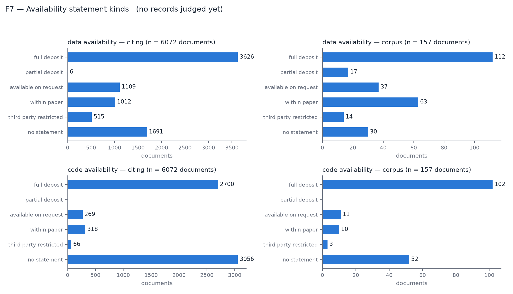

# closeread

Close reading for scientific corpora: every claim anchored in the text itself.

closeread reads the full text of a research consortium's publications and of
the papers that cite them, and extracts structured facts about two things: how
the consortium built its datasets, and how other researchers reused them. Every
extracted fact carries a verbatim quotation and its character offsets in the
source document. A fact that cannot be tied to a quotation is never shipped.

It does **not** count citations or treat keyword matches as meaning. Regular
expressions only locate text; a model decides meaning, and a second, different
model judges the result.

The first community is [HTAN](https://humantumoratlas.org) (Human Tumor Atlas
Network). Community specifics live in `communities/*.yaml`, not in code.

## What a record looks like

```json
{
  "doc_id": "W3158464056",
  "extraction_class": "data_availability",
  "source_quote": "TCGA variant calls were downloaded from the Synapse portal",
  "char_start": 71312,
  "char_end": 71370,
  "source_section": "methods",
  "alignment_status": "match_exact",
  "attributes": {
    "repository": "Synapse",
    "access_mechanism": "direct_download",
    "statement_kind": "full_deposit",
    "direction": "acquired"
  }
}
```

Note `direction: acquired`. The same accession in the same section can mean
"we released this" or "we downloaded someone else's data"; the verb decides,
which is why a pattern match is never allowed to decide meaning.

## How it works

```
acquire -> parse -> candidates -> extract -> collect -> normalise -> judge -> report
```

| Stage | What it does |
|---|---|
| `acquire` | OpenAlex metadata and citation graph; full text from the PMC OA bucket and the bioRxiv/medRxiv source buckets; preprint/published pairs deduplicated; every citing work classified by author overlap with the consortium |
| `parse` | JATS XML to plain text plus a section index with stable character offsets |
| `candidates` | Regex matches (accessions, repo URLs) that locate text and measure recall, never meaning |
| `extract` | One Gemini batch job per pass. A pass carries a small set of related classes; prompt, response schema, and validator all compile from one YAML |
| `collect` | Align every quotation against the source text; unaligned records are rejected, never shipped; documents with no statement get an explicit absence record |
| `normalise` | Canonical vocabularies generated by a model over distinct values, applied deterministically; raw values are never overwritten |
| `judge` | A different model re-reads each record in context, with the document's candidates as evidence, and returns confirmed / rejected / uncertain |
| `report` | Gold tables, eight figures, and a REPORT.md in which every number is computed at render time |

Records flow through four layers: `raw` (immutable fetches and responses),
`bronze` (aligned records), `silver` (canonicalised and judged), `gold` (one
flat CSV per class; opens in Excel, loads in R with one line).

## What it extracts

| Pass | Classes | Read from |
|---|---|---|
| `availability` | data_availability, code_availability | whole document, both corpora |
| `measurement` | assay_platform, object_format | whole document, both corpora |
| `analysis` | cell_typing, tme_algorithm | whole document, both corpora |
| `provenance` | engagement, data_acquisition | anchor windows in citing documents only |
| `abstract` | abstract_claim | abstracts, including works with no full text |

The provenance pass reads only text near an anchor (a citation of a corpus
paper, a consortium identity string, or an accession the consortium released).
Reading whole citing documents attributed any reuse in the paper to the
consortium and measured 57 percent precision in the prototype; anchor windows
exist because of that measurement.

## Guard rails, each paid for by a measured failure

- **Passes stay small.** Adding a fifth class to a four-class prompt cost 58
  percent of one class's recall.
- **Canary before every fan-out.** Two real requests through the real batch
  path must return STOP, complete attributes, and an alignable quotation
  before anything larger is submitted. Its absence once cost 21 USD.
- **camelCase `generationConfig`.** The batch endpoint silently ignores
  snake_case. A unit test guards the casing.
- **Attribute completeness lives in the prompt**, not just the schema.
- **Vocabularies are generated, not hand-written.** Two rounds of manual
  dictionary editing still left 14 percent of values unmapped.
- **Nothing is deleted.** Rejected records, unaligned quotes, and superseded
  runs stay on disk with status fields.
- **Every share carries its denominator**, and every reuse aggregate is split
  into consortium-internal vs external authorship.

## Quick start

```bash
uv sync
echo 'GEMINI_API_KEY=...' > .env        # never committed
aws sso login --profile htan-dev        # only needed for bioRxiv/medRxiv tier

uv run closeread acquire --community htan            # metadata + full text (free)
uv run closeread parse   --community htan
uv run closeread candidates --community htan
uv run closeread extract --community htan --pass availability --dry-run
uv run closeread extract --community htan --pass availability
uv run closeread status  --run <run_id>
uv run closeread collect --run <run_id>
uv run closeread report  --runs <run_id>
```

Every submitting command supports `--dry-run` (request count, token and cost
estimate). Useful extras: `--model` to override the pass model, `--doc-type
citing` for the citing corpus, `--sample N` for a seeded document sample,
`--only-missing` to top up coverage without resubmitting.

Tests are offline and fast: `uv run pytest`.

## Outputs

Outputs are never committed here (`out/` is gitignored). The HTAN run is
published on Synapse at
[syn76993185](https://www.synapse.org/#!Synapse:syn76993185), public to view
with download for registered Synapse users:

| Synapse folder | Contents |
|---|---|
| [metadata](https://www.synapse.org/#!Synapse:syn76993186) | documents.jsonl, citation_edges.jsonl, candidates.jsonl, vocab_map.jsonl, model_gap_500_sample.json |
| [silver](https://www.synapse.org/#!Synapse:syn76993187) | judged, canonicalised records, one JSONL per run |
| [gold](https://www.synapse.org/#!Synapse:syn76993188) | one flat CSV per extraction class |
| [report](https://www.synapse.org/#!Synapse:syn76993189) | REPORT.md and figure_manifest.json |
| [figures](https://www.synapse.org/#!Synapse:syn76993190) | eight figures (SVG and PNG), each with a CSV of exactly the plotted data |
| [runs](https://www.synapse.org/#!Synapse:syn76993191) | per-run summaries: model, tokens, finish reasons, alignment and attribute-population rates |

The raw layer (fetched publisher XML, batch responses) and the bronze layer
stay local: full text is third-party content that must not be redistributed,
and it is re-fetchable from its sources. Published layers carry only
quotation-scale excerpts with offsets.



## Reading the numbers honestly

- Precision is measured against 200 human-labelled records: judge precision
  93 percent and recall 96 percent; extraction precision 97 percent for
  data_acquisition and 86 percent for engagement. Figure F8 states coverage
  and measured precision per class and should be read before any other figure.
- The most frequent extraction error, from the labelling notes: a citing
  paper's own data-availability statement misread as data reuse (statements of
  where data had been shared counted as reuse). Read `data_reuse` counts with
  that bias in mind; the judge catches most but not all of these.
- Every pass in the published results ran on the strong model. The citing
  passes were first run on the small model; a 500-document dual-model sample
  then measured span-level recall of 42 to 62 percent and, after strong-judge
  adjudication, record-level false-positive rates of 14 to 38 percent per
  class, so the citing passes were re-run on the strong model and the
  small-model citing runs were superseded (retained on disk, excluded from
  the report). The measurement files ship with the outputs
  (model_gap_500_sample.json, small_model_citing_judged_sample.json).
- Absence is recorded, never implied: a document with no availability
  statement contributes an explicit `no_statement` record.

## Documentation

| | |
|---|---|
| `docs/getting-started.md` | install, credentials, one complete run of the cheapest pass |
| `docs/adding-a-pass.md` | the pass YAML reference |
| `docs/adding-a-community.md` | the community YAML reference, worked through with CCKP |
| `docs/interpreting-the-report.md` | what each figure means, its denominator, its precision caveat |

The full design specification, including the prototype measurements that
motivated each rule, lives outside this repository (see `CLAUDE.md`).
